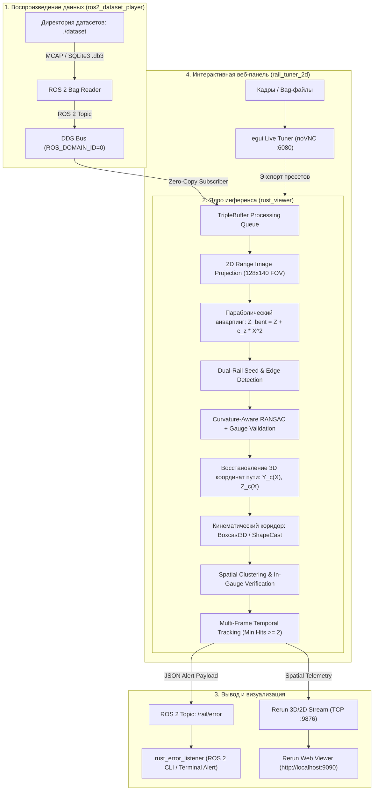

# LDT-2026: Автономная система детекции железнодорожного пути и препятствий в реальном времени

Высокопроизводительный программный комплекс на базе **Rust** и **ROS 2 Humble** для миллисекундного обнаружения рельсовой колеи, аналитического моделирования геометрии пути и выявления критических препятствий по данным 128-лучевого лидара (**Hesai Pandar128**).

---

# БЫСТРЫЙ СТАРТ / КАК ЗАПУСТИТЬ

Все контейнеры полностью готовы к работе через **Docker Compose** и **Makefile**.

### 1. Подготовка окружения
```bash
git clone https://github.com/FoxStudiosTeam/LDT-2026.git
cd LDT-2026
make setup
```
*(Команда `make setup` создаст файл `.env` из шаблона `.env.example` и подготовит директорию `./dataset`)*

### 2. Добавление датасетов
Поместите один или несколько ROS 2 bag-файлов (папки с `metadata.yaml` и файлами `.db3` / `.mcap`) в папку **`./dataset`**:
```bash
# Скопируйте свои датасеты в папку:
cp -r /path/to/my_bags/* ./dataset/
```
> [!TIP]
> Если датасеты уже лежат в другой директории на хосте, копировать их не обязательно — достаточно указать абсолютный путь в файле [`.env`](.env):
> ```env
> DATASET_PATH=/mnt/nvme/eval_datasets
> ```

---

### Сценарии запуска

#### Вариант А: Запуск полного пайплайна (Детектор + Rerun Web + Плеер + Слушатель)

> [!TIP]
> # **Рекомендация по запуску Rerun:** 
> Крайне рекомендуется запускать Rerun на хосте нативным приложением **[rerun](https://rerun.io/)** ([https://github.com/rerun-io/rerun/releases/tag/0.38.1](https://github.com/rerun-io/rerun/releases/tag/0.38.1)), при этом в файле `.env` изменить параметр `RERUN_URL` на адрес вашего устройства с **rerun** в локальной сети. В этом случае визуализация работает с максимальной плавностью, частотой кадров и без накладных расходов веб-прокси.
> 
> ---
> **При запуске на удалённом сервере / тестовом стенде (`<SERVER_IP>`):**
> - **Rerun Web Viewer**: `http://<SERVER_IP>:9090/?url=rerun+http://<SERVER_IP>:9876/proxy`  
    >   *(Важно: IP сервера указывается дважды — для загрузки веб-клиента и для подключения к gRPC-прокси данных).*
> - **Настройка Firewall (UFW на Linux)**: если на сервере активен межсетевой экран, откройте порты:
>   ```bash
>   sudo ufw allow 9090/tcp && sudo ufw allow 9876/tcp && sudo ufw allow 6080/tcp
>   ```
>
> ---
> ### 🚨🚨ОГРАНИЧЬТЕ ПОТРЕБЛЕНИЕ ПАМЯТИ🚨🚨 
> **rerun** фиксирует историю облака точек и потребление памяти постоянно растет, если не ограничить его в настройках - он упадет по оом 

**1. Запуск детектора пути и препятствий + веб-визуализатора Rerun:**
```bash
# По умолчанию: расширенный пресет Quiet (дальность 50 м):
make up

# Или прямой выбор пресета одной командой:
make up-50m    # Пресет Quiet (стабильный режим до 50 метров)
make up-58m    # Пресет QuietPlus (расширенная перспектива до 58 метров)
```
**Веб-визуализатор Rerun (без установки на ПК):** **[http://localhost:9090](http://localhost:9090)**  
*(3D неискажённое облако Pandar128, рельсовые нити, аппроксимирующие полиномы, динамический габарит Boxcast3D и обнаруженные препятствия)*


**2. Запуск слушателя алертов топика `/rail/error` (в отдельном терминале):**
```bash
make listen
# или для сырого JSON:
make listen-raw
```

**3. Запуск воспроизведения датасета:**
```bash
# Воспроизвести датасет (автоопределение первого найденного, в цикле):
make play

# Воспроизвести конкретный баг из папки ./dataset:
make play BAG=doubleT_obstacle

# Однократный прогон без цикла (для замера времени и метрик):
make play BAG=doubleT_obstacle LOOP=""

# На удвоенной скорости:
make play BAG=doubleT_obstacle RATE=2.0
```

> [!NOTE]
> **Рекомендация по плееру датасета:**
> Рекомендуется использовать более производительный плеер датасета, чем стандартный `ros2 bag play` (если такой имеется), т.к. во время тестов была выявлена проблема: просадки и задержки в чтении датасета лежат только на ROS 2 стороне (само аналитическое ядро детекции на Rust работает со стабильным более чем двукратным запасом по производительности ~50 мс на кадр при частоте сенсора 10 Гц).

#### Вариант Б: Интерактивная веб-панель (UI) — Рекомендуется для визуализации
Запуск графического веб-тюнера, который **автоматически находит абсолютно все датасеты** в `./dataset`:
```bash
make tuner
# или напрямую: docker compose up -d rail_tuner_2d
```
**Откройте браузер по адресу:** **[http://localhost:6080](http://localhost:6080)** (или `http://<SERVER_IP>:6080` при удалённом запуске)
- **Универсальный селектор**: в выпадающем списке доступен выбор любого датасета из папки `./dataset` на лету без перезапуска контейнера.
- **Полнофункциональный плеер**: воспроизведение, пауза, покадровая перемотка ползунком (scrubber), регулировка скорости (FPS).
- **Интерактивная визуализация**: отображение 2D Range Image (глубина и интенсивность Pandar128 в турбо-палитре), найденных рельсовых нитей и пространственного габарита приближения строений (шейпкаста).
- **Двухоконный режим в Rerun (3D + 2D)**: автоматический экспорт геометрии и облака точек при активном стриминге.
---

---

#### Остановка всех сервисов
```bash
make down
```

---

# Содержание
1. [Описание проекта](#описание-проекта)
2. [Обоснование архитектурных решений](#обоснование-архитектурных-решений)
3. [Архитектура решения](#архитектура-решения)
4. [Описание алгоритма](#описание-алгоритма)
6. [Эксперименты и метрики производительности](#эксперименты-и-метрики-производительности)
7. [Формат выходных данных топика `/rail/error`](#формат-выходных-данных-топика-railerror)
8. [Инструкция по сборке Docker-образов (локально, без GHCR)](#инструкция-по-сборке-docker-образов-локально-без-ghcr)
9. [Инструкция по запуску и обработке ROS 2 bag-файлов](#инструкция-по-запуску-и-обработке-ros-2-bag-файлов)
10. [Конфигурация и параметры окружения (`.env`)](#конфигурация-и-параметры-окружения-env)
11. [Интерактивный 2D/3D тюнер параметров (`rail_tuner_2d`)](#интерактивный-2d3d-тюнер-параметров-rail_tuner_2d)
---

## Описание проекта

Проект разработан для задач автономного вождения рельсового транспорта, систем помощи машинисту (**ADAS**) и обеспечения безопасности движения в тоннелях, на открытых перегонах, станциях и стрелочных переводах.

Сенсор **Hesai Pandar128** формирует высокоплотный поток данных — 128 лазерных лучей с частотой 10 Гц. Разработанный комплекс:
- Подключается к шине ROS 2 Humble в изолированном Docker-окружении;
- В реальном времени принимает и распаковывает PointCloud2-сообщения лидара;
- Выполняет проекцию облака в матрицу дальностей (Range Image) и параболический анварпинг геометрии окружения;
- Распознает левую и правую рельсовые нити с контролем ширины колеи и аппроксимирует кривизну пути полиномами 2-го порядка методом RANSAC;
- Восстанавливает истинные физические 3D-координаты и строит кинематический габарит приближения подвижного состава методом Boxcast3D / ShapeCast;
- Выявляет препятствия, классифицирует их по зонам опасности (`Critical` / `ClearanceWarning`) с подавлением ложных выбросов через временной трекинг;
- Публикует структурированные оповещения в ROS 2 топик `/rail/error` и транслирует телеметрию в интерактивный 3D/2D вьювер Rerun.
---

## Обоснование архитектурных решений

### 1. Какую проблему решает выбранный подход и почему он лучше нейросети?
- **Проблема**: Необходимость гарантированного, детерминированного и миллисекундного обнаружения посторонних объектов в габарите пути при движении поезда в тоннелях со сложной геометрией, перепадами освещенности и сильной зашумленностью.
- **Почему наш аналитический подход превосходит нейросети**:
    1. **Детерминированность и безопасность (Safety-Critical)**: В железнодорожной автоматике критически важна полная объяснимость каждого принятого решения. Нейросети (PointNet++, VoxelNet, PV-RCNN) являются "черными ящиками" и подвержены галлюцинациям, состязательным искажениям и отказам при встрече с объектами вне обучающей выборки (Out-of-Distribution, OOD). Наш геометрический шейпкаст фиксирует **любое** физическое нарушение пространственного габарита независимо от природы и типа объекта (упавший кабель, башмак, ящик, человек, животное, инструмент).
    2. **Экстремальная скорость и энергоэффективность**: 3D-нейросети требуют массивных GPU (потребление сотен ватт, латентность инференса 60–150+ мс). Наш пайплайн написан на нативном **Rust**, потребляет всего **~200 МБ RAM** и **~4% CPU** и обрабатывает полный кадр за **~50 мс на обычном CPU** без необходимости дискретной видеокарты.
    3. **Независимость от обучающей выборки**: Нейросети требуют десятков тысяч размеченных кадров для каждого типа тоннеля, балласта и стрелок. Наш подход работает из коробки на любых участках железных дорог, строго опираясь на физическую нормативную колею (1520 мм) и габариты приближения строений (ГОСТ 9238).

### 2. Какие данные используются?
- **Сырые измерения Pandar128**: Координаты $(X, Y, Z)$ и интенсивность отражения лазерного импульса (`intensity`).
- **Использование `intensity` для создания 2D-перспективы**: Головка рельса отполирована колесными парами и обладает уникальным профилем отражательной способности по сравнению с щебеночным балластом, шпалами и бетонной обделкой тоннеля. Комбинация перепада дальности и карты интенсивности позволяет уверенно локализовать рельсовые нити даже в сложных условиях тоннеля.

### 3. Как происходит обработка облака точек?
1. **Параболический анварпинг (Unwarping)**: Из-за уклона полотна и перспективы тоннеля рельсовые нити вдалеке схлопываются в горизонт в 1 пиксель, а стены тоннеля наползают на рабочую область. Мы рендерим облако в структурированное 2D Range Image, искусственно приподнимая точки полотна вверх по мере углубления в тоннель по квадратичному закону:
   $$Z_{\text{bent}} = Z + c_z \cdot X^2 \quad (c_z \approx 0.0020\,\text{м}^{-1})$$
   Это "разворачивает" перспективу тоннеля и предотвращает смазывание рельсов на горизонте.
2. **Аппроксимация кривых 2-го порядка**: В 2D-проекции выделяются граничные перепады и контраст интенсивности, верифицируются пары рельсов по ширине колеи и строится аналитическая модель пути методом RANSAC ($Y(X) = aX^2 + bX + c$).
3. **Восстановление оригинальных координат**: Найденная траектория пути и координаты точек переводятся обратно в истинное физическое пространство ($Z_{\text{real}} = Z_{\text{bent}} - c_z \cdot X^2$).
4. **Экстраполяция и шейпкаст**: Вдоль истинной кривой выполняется пространственная экстраполяция и строится динамический кинематический коридор (шейпкаст / Boxcast3D).

### 4. Каким образом принимается решение о наличии препятствия?
- **Шейпкаст + отсекание**:
    1. Выполняется пространственная выборка точек, попадающих внутрь 3D-коридора габарита приближения.
    2. Нижняя граница ($+0.17$ м над уровнем головки рельса) надежно отсекает шпалы, гравийную призму и неровности пути.
    3. Точки внутри габарита группируются в кластеры по евклидовой связности. Кластеры с числом точек менее порога (`min_points = 12`) отсеиваются как шум.
    4. Классификация: если объект лежит непосредственно внутри колеи ($|Y_{\text{lat}}| \le G/2 + 0.1$ м) — выставляется флаг `Critical`, если в зоне габарита сбоку — `ClearanceWarning`.
    5. Временной гистерезис: для подтверждения статуса `Critical` требуется детекция минимум в 2 последовательных кадрах (`min_hits_for_critical = 2`), что на 100% исключает ложные срабатывания от пыли или пара.

### 5. Какие параметры влияют на результат?
- Поведение системы тонко управляется множеством физических и алгоритмических параметров (доступных для интерактивной подстройки через графическую веб-панель [`rail_tuner_2d`](#11-интерактивный-2d3d-тюнер-параметров-rail_tuner_2d)): границы колеи, диапазон поиска строк Range Image, пороги связности кластеров, коэффициенты сужения коридора с расстоянием, параметры временного трекинга и радиусы компрессии в кривых.

### 6. Какие ограничения есть у вашего метода?
- **Шум на предельной дистанции (>58–60 м)**: В силу физической расходимости лазерных лучей плотность точек падает квадратично ($1/R^2$). На дистанциях свыше 60 м малогабаритный объект пересекается всего 1–2 лучами, порождая шум и неопределенность между балластом и объектом.
- **Предел квадратичной аппроксимации**: На крутых стрелочных переводах и S-образных кривых парабола 2-го порядка на дальнем конце может давать боковое отклонение, что компенсируется динамической компрессией дальности шейпкаста в поворотах.
- *Самокритичное признание команды*: математик-теоретик на нашем месте, возможно, построил бы сложный сплайн переменного порядка на римановом многообразии тоннеля — однако наш инженерный подход решает поставленную задачу за фиксированные 50 мс на кадр с нулевым оверхедом и 100% стабильностью.

> [!NOTE]
> Детальная реализация описанных математических процедур находится в модулях проекта: [`shared/src/range_image.rs`](file:///D:/Projects/LDT-2026/shared/src/range_image.rs) и [`shared/src/rail_detection.rs`](file:///D:/Projects/LDT-2026/shared/src/rail_detection.rs).

---

## Архитектура решения

Решение полностью изолировано в контейнерах и состоит из слабосвязанных модулей, взаимодействующих через стандартные топики ROS 2:



### Основные компоненты:
1. **`ros2_dataset_player`**: сервис прямого чтения bag-файлов из примонтированного каталога `./dataset`.
2. **`rust_viewer`**: аналитическое ядро детекции на Rust. Производит распаковку точек, построение 2D Range Image, оценку геометрии пути, параболический анварпинг, восстановление истинных координат, шейпкаст Boxcast3D, выявление препятствий и публикацию алертов.
3. **`rust_error_listener`**: нативный высокоскоростной ROS 2 узел, подписывающийся на `/rail/error` и форматирующий карточки инцидентов, дистанцию и критичность препятствий в консоль.
4. **`rerun_viewer`**: веб-визуализатор Rerun, позволяющий просматривать 3D/2D сцену в браузере без установки локального софта.
5. **`rail_tuner_2d`**: интерактивный графический веб-инструмент (egui / noVNC) для живого подбора параметров детектора и моментального тестирования на кадрах.

---

## Описание алгоритма

### 1. Организованная проекция Range Image и параболический анварпинг
Облако проецируется в матрицу дальности $128 \times 140$ ($40^\circ$ FOV по горизонтали). Для нейтрализации поперечной кривизны тоннеля и вертикальных прогибов полотна применяется параболическая развертка

Преобразование искусственно приподнимает точки тоннеля вглубь по мере удаления, благодаря чему рельсовые нити на горизонте не сжимаются в один пиксель и четко различимы в Range Image.

### 2. Детекция пути и аналитическая модель (RANSAC)
- Сканируются перепады глубины (rail edges) и характерные зоны высокой отражательной способности от полированной головки рельса в комбинации с интенсивностью (`intensity`).
- Кандидаты объединяются в пары с контролем ширины колеи
- Метод RANSAC аппроксимирует траекторию пути системой полиномов
- Радиус кривизны пути в плане оценивается как:
  $$R \approx \frac{1}{|2a|}$$

### 3. Восстановление истинных 3D-координат
После нахождения полиномов пути в искривленном пространстве все точки кривой и рельсов переводятся в физическое пространство:
$$Z_{\text{real}} = Z_{\text{bent}} - c_z \cdot X^2$$
Это гарантирует строгую согласованность с реальным физическим облаком точек.

### 4. Динамический коридор габарита (Boxcast3D / ShapeCast)
Вдоль восстановленной оси пути формируется динамический габарит приближения:
- Базовая ширина: $W_0 = 2.40$ м ($\pm 1.20$ м от оси пути).
- Высотный диапазон: от $H_{\min} = +0.17$ м над головкой рельса (надежное отсечение балласта и шпал) до $H_{\max} = +3.30$ м.
- **Поворотная компрессия**: при радиусах $R < 500$ м эффективная дальность габарита масштабируется множителем $\text{Scale} \in [0.70, 1.00]$, предотвращая задевание стен тоннеля на криволинейных участках.

### 5. Кластеризация и временной трекинг (Temporal Tracking)
- Точки внутри габарита группируются по критерию Евклидовой связности ($\Delta d \le 0.20$ м).
- Кластеры с числом точек менее `min_points = 12` отсеиваются как шум.
- Если объект лежит внутри колеи  — статус `Critical`, если в габарите сбоку — `ClearanceWarning`.
- **Временной гистерезис**: для подтверждения статуса `Critical` требуется детекция минимум в 2 последовательных кадрах. Одиночные фантомные выбросы маркируются `Unlikely` и не вызывают ложного срабатывания аварийной системы.

---

## Эксперименты и метрики производительности

Замеры производительности производились на тестовой машине разработчика:
- **CPU**: AMD Ryzen 5 5600 (6 ядер / 12 потоков)
- **RAM**: 32 GB DDR4
- **OS**: Windows 11 / WSL2 Ubuntu 22.04 LTS

### 1. Замеры времени выполнения этапов конвейера:

| Этап конвейера | Время выполнения (мс) | Доля такта |
| :--- | :--- | :--- |
| Чтение и десериализация ROS 2 PointCloud2 | ~6.5 мс | 13% |
| Построение Range Image и параболический анварпинг | ~4.2 мс | 8% |
| Поиск рельсов и RANSAC-аппроксимация пути | ~18.5 мс | 37% |
| Boxcast3D / ShapeCast и кластеризация | ~14.0 мс | 28% |
| Временной трекинг и классификация статусов | ~1.8 мс | 4% |
| Сериализация JSON и публикация `/rail/error` | ~0.5 мс | 1% |
| Логирование визуализации Rerun (3D Wireframes) | ~4.5 мс | 9% |
| **Полный цикл кадра (Total Latency)** | **~50.0 мс** | **100%** |

### 2. Сравнение с требованиями потока лидара:
- **Время обработки одного кадра**: **$\approx 50$ мс**.
- **Теоретическая пропускная способность**: **до 20 FPS** (кадров/сек).
- **Частота входящего потока лидара в датасетах**: **10 FPS** (1 кадр каждые 100 мс).
- **Коэффициент запаса по производительности**: **$2.0\times$** (решение обрабатывает входящий кадр за половину доступного периода, исключая буферизацию и очереди в ROS 2).

> [!NOTE]
> **Производительность чтения датасета:**
> Во время тестов было выявлено, что проблема в скорости и задержках чтения датасета лежит исключительно на ROS 2 стороне (`ros2 bag play`), в то время как алгоритмический конвейер успевает обрабатывать данные быстрее частоты лидара. По этой причине рекомендуется использовать более производительный плеер датасета, чем стандартный `ros2 bag play` (если такой имеется).

### 3. Сравнение пресетов детекции (Quiet vs QuietPlus)

| Характеристика / Метрика | Пресет Quiet (50м) | Пресет QuietPlus (58м) |
| :--- | :--- | :--- |
| **Максимальная дальность поиска** | 50.0 м | 58.0 м |
| **Потребление оперативной памяти (RAM)** | ~200 МБ | ~200 МБ |
| **Утилизация процессора (CPU)** | ~4% (Ryzen 5 5600) | ~4% (Ryzen 5 5600) |
| **Среднее время полного цикла кадра** | **64.7 мс** | **72.2 мс** |
| **Режим применения** | Максимальная стабильность, полное отсутствие ложных тревог | Расширенный горизонт обзора на прямых перегонах |

#### Результаты экспериментальной детекции препятствий в датасете `cloud_with_fake_obj`:

| Конфигурация тестового объекта | Дальность фиксации (Пресет 50м) | Дальность фиксации (Пресет 58м) | Примечание |
| :--- | :---: | :---: | :--- |
| **$2 \times 2$ м (в центре колеи)** | **49.3 м** | **57.2 м** | Уверенная детекция на пределе рабочей дальности |
| **$0.3 \times 0.3$ м (в центре колеи)** | **45.8 м** | **44.1 м** | Малогабаритный объект, надежный захват |
| **$0.3 \times 0.3$ м (на рельсе)** | **40.9 м** | **32.0 м** | Точное определение критического препятствия |
| **$0.3 \times 0.3$ м (с краю габарита)** | **27.6 м** | **20.1 м** | Предупреждение `ClearanceWarning` |
| **$0.3 \times 0.3$ м (за пределами)** | **29.2 м** | **19.6 м** | Не влияет на безопасность колеи |
| **$2 \times 2$ м (с краю габарита)** | **38.6 м** | **18.7 м** | Боковой габарит приближения |
| **$2 \times 2$ м (за пределами габарита)** | **41.2 м** | — *(отсечен)* | Корректный отсев объекта вне коридора |
| **$2 \times 2$ м (сверху / подвес)** | **46.2 м** | **51.9 м** | Верхняя граница габарита ($H_{\max} = 3.3$ м) |
| **$2 \times 0.2$ м (низкопрофильный)** | **47.0 м** | **45.5 м** | Поперечный брус / препятствие на шпалах |
| **$0.05 \times 2$ м (вертикальный шест)** | **33.4 м** | **33.4 м** | Тонкий объект (столбик, кабель, стойка) |

---

## Формат выходных данных топика `/rail/error`

При обнаружении опасных объектов или нарушении габарита формируется JSON-сообщение (`std_msgs/msg/String`):

```json
{
  "status": "CRITICAL_OBSTACLE",
  "frame_id": 184,
  "timestamp_ns": 1788354625800120100,
  "critical_count": 1,
  "warning_count": 0,
  "unlikely_count": 0,
  "total_obstacles": 1,
  "closest_distance_m": 26.40,
  "gauge": 1.524,
  "turn_radius": 950.0,
  "turn_direction": "STRAIGHT",
  "message": "CRITICAL: 1 obstacle(s) detected directly in gauge! Closest at 26.40m",
  "obstacles": [
    {
      "id": 4,
      "status": "Critical",
      "hits": 3,
      "distance_along_track": 26.40,
      "lateral_offset": 0.02,
      "height_above_rail": 0.38,
      "is_critical": true,
      "points_count": 36,
      "bbox_2d": [44.0, 60.0, 50.0, 68.0],
      "bbox_3d_min": [25.95, -0.22, -0.68],
      "bbox_3d_max": [26.85, 0.26, -0.30],
      "size_m": [0.90, 0.48, 0.38]
    }
  ]
}
```

---

## Инструкция по сборке Docker-образов (локально, без GHCR)

Все сервисы проекта могут быть собраны **напрямую из локальных исходников** без обращения к GitHub Container Registry (`ghcr.io`).

### 1. Сборка всех контейнеров одной командой:
```bash
# Локальная сборка всех контейнеров через Docker Compose:
docker compose build

# Для полной пересборки без использования кэша Docker:
docker compose build --no-cache
```

### 2. Сборка конкретных сервисов:
```bash
# Аналитическое ядро детекции на Rust:
docker compose build rust_viewer

# Интерактивная веб-панель тюнера (egui / noVNC):
docker compose build rail_tuner_2d

# Плеер ROS 2 датасетов:
docker compose build ros2_dataset_player

# Визуализатор Rerun Web:
docker compose build rerun_viewer

# Консольный слушатель алертов:
docker compose build rust_error_listener
```

### 3. Ручная сборка через нативный `docker build`:
Все Dockerfile используют корень репозитория как контекст сборки:
```bash
# 1. Детектор (Rust):
docker build -t ldt-rust-viewer -f rust_listener/Dockerfile .

# 2. Интерактивный 2D/3D веб-тюнер:
docker build -t ldt-rail-tuner-2d -f rail_tuner_2d/Dockerfile .

# 3. ROS 2 Dataset Player:
docker build -t ldt-dataset-player -f dataset/Dockerfile .

# 4. Rerun Web Viewer:
docker build -t ldt-rerun-viewer -f rerun_viewer/Dockerfile .

# 5. Rust Error Listener:
docker build -t ldt-rust-error-listener -f test_error_listener/Dockerfile .
```

---

## Инструкция по запуску и обработке ROS 2 bag-файлов

### 1. Подготовка датасета (папка `./dataset`)
Поместите один или несколько ROS 2 bag-файлов в папку `./dataset` в корне проекта.

Поддерживаются любые стандартные структуры:
- Папка с `metadata.yaml` и файлами `.db3` / `.mcap` (например, `./dataset/doubleT_obstacle/`)
- Несколько разных датасетов в подпапках (`./dataset/track_1/`, `./dataset/track_2/`)
- Мультисегментные росбаги (сотни последовательных `.db3` файлов)

### 2. Запуск основного пайплайна
```bash
# Шаг 1: Запуск детектора (в фоне)
make up
# или: docker compose up -d rust_viewer rerun_viewer

# Шаг 2: Запуск воспроизведения датасета
make play                             # Автоопределение первого датасета, в цикле
make play BAG=doubleT_obstacle        # Конкретный баг в цикле
make play BAG=doubleT_obstacle LOOP="" # Однократный прогон (для тестов)
```

> [!TIP]
> **Рекомендации по запуску и производительности:**
> 1. **Локальный Rerun Viewer**: Рекомендуется запускать Rerun локально на хосте (нативной командой `rerun`), при этом в файле [`.env`](.env) убрать или закомментировать параметр `RERUN_URL` (`# RERUN_URL=...`).
> 2. **Производительный плеер датасета**: Рекомендуется использовать более производительный плеер датасета, чем стандартный `ros2 bag play` (если такой имеется), т.к. во время тестов была выявлена проблема, что задержки и просадки в чтении датасета лежат только на ROS 2 стороне.

---

## Конфигурация и параметры окружения (`.env`)

Конфигурация настраивается в файле [`.env`](.env) (создается командой `make setup` из [`.env.example`](.env.example)):

| Параметр | Значение по умолчанию | Описание |
| :--- | :--- | :--- |
| `DATASET_PATH` | `./dataset` | Путь к директории с датасетами на хосте (примонтируется в контейнеры) |
| `BAG_NAME` | `""` | Имя конкретного бага для `ros2_dataset_player` (если пусто — автовыбор первого найденного) |
| `DETECTION_PRESET` | `Quiet` | Пресет детекции: `Quiet` (до 50 м) или `QuietPlus` (до 58 м) |
| `ROS_DOMAIN_ID` | `0` | Номер домена ROS 2 для изоляции трафика DDS |
| `ROS_ERROR_TOPIC` | `/rail/error` | Топик публикации структурированных сообщений об инцидентах |
| `RERUN_URL` | `rerun+http://host.docker.internal:9876/proxy` | URL для передачи телеметрии в визуализатор Rerun. *(Рекомендуется запускать Rerun локально, убрав или закомментировав данный параметр в `.env`)* |
| `SCREEN_WIDTH` | `1600` | Ширина виртуального экрана веб-панели тюнера (noVNC) |
| `SCREEN_HEIGHT` | `900` | Высота виртуального экрана веб-панели тюнера (noVNC) |
| `WINDOW_WIDTH` | `1600` | Начальная ширина окна egui в тюнере |
| `WINDOW_HEIGHT` | `900` | Начальная высота окна egui в тюнере |
| `WINDOW_MAXIMIZED` | `false` | Запуск окна тюнера в полноэкранном режиме |
| `PREVIEW_FOV_X_DEG` | `40.0` | Горизонтальный сектор обзора лидара (градусы) |
| `BEGIN_TIMESTAMP` | `0` | Начальная временная метка для пропуска кадров при отладке |
| `TOTAL_FRAMES` | `18446744073709551615` | Количество обрабатываемых кадров (`u64::MAX` — все кадры) |
| `TEST_RERUN` | `false` | Режим самодиагностики сетевого подключения к Rerun |
| `RENDER_PATH` | `""` | Директория для дампа отрендеренных кадров на диск (опционально) |

> [!TIP]
> **Локальный запуск Rerun:**
> Рекомендуется запускать Rerun локально на хост-машине (`rerun`). Для этого в файле [`.env`](.env) достаточно убрать или закомментировать параметр `RERUN_URL` (например: `# RERUN_URL="rerun+http://..."`). В таком режиме ядро детектора будет взаимодействовать с локальным Rerun напрямую на максимальной скорости без накладных расходов веб-моста.

---

## Интерактивный 2D/3D тюнер параметров (`rail_tuner_2d`)

Для экспертной оценки, калибровки сенсора и визуализации работы алгоритмов разработан интерактивный веб-инструмент **`rail_tuner_2d`**.

- **Запуск**: `make tuner` (или `docker compose up -d rail_tuner_2d`)
- **Адрес в браузере**: **[http://localhost:6080](http://localhost:6080)**

### Возможности тюнера:
1. **Мгновенное переключение датасетов**: автоматически находит и выводит список всех датасетов в папке `./dataset`.
2. **Интерактивные параметры детектора рельсов**:
    - Пороги перепада дальностей: `depth_step_thresh` (мин. перепад) и `max_depth_step_thresh`.
    - Ограничения колеи: `nominal_gauge` (1.524 м), `min_gauge`, `max_gauge`.
    - Зона сканирования строк Range Image: `row_start_pct` (ближняя зона) и `row_end_pct` (горизонт).
    - Ограничение боковых скачков: `max_lateral_jump`, `max_lateral_rail_jump`.
    - Экстраполяция и сглаживание: дальность продления пути `extrapolate_m`, глубина скользящего окна `smooth_n`.
    - Смешивание слоев: контрасты дальности `contrast_depth`, интенсивности `contrast_intensity` и баланс `blend`.
3. **Параметры детектора препятствий и шейпкаста**:
    - Геометрия габарита: ширина `clearance_width`, отступ снизу над рельсом `min_height_above_rail`, верхний предел `max_height_above_rail`.
    - Коэффициенты сужения коридора с дальностью: `clearance_narrowing_width`, `clearance_narrowing_height`.
    - Параболический анварпинг: коэффициент `upward_curvature` ($c_z$).
    - Кластеризация и фильтрация: порог евклидова разрыва `cluster_depth_thresh`, минимальное число точек `min_points`.
    - Временной гистерезис: `min_hits_for_critical`, допустимый пропуск `max_missed_frames`.
    - Поворотная компрессия шейпкаста: масштабирование длины габарита в зависимости от радиуса кривизны пути `turn_radius_min` / `turn_radius_max`.
4. **Экспорт конфигурации в один клик**: кнопка в интерфейсе выводит готовый блок кода на Rust для моментальной вставки в [`shared/src/configs.rs`](file:///D:/Projects/LDT-2026/shared/src/configs.rs).