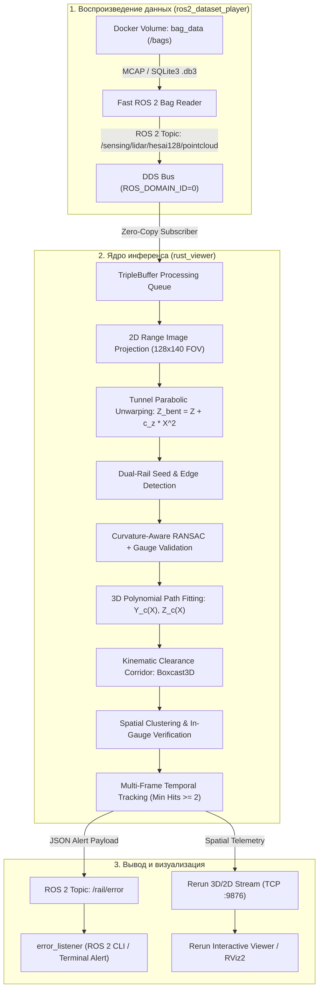

# LDT-2026: Автономная система детекции железнодорожного пути и препятствий в реальном времени

Высокопроизводительный программный комплекс на базе **Rust** и **ROS 2 Humble** для миллисекундного обнаружения рельсовой колеи, аналитического моделирования геометрии пути и выявления критических препятствий по данным 128-лучевого лидара (**Hesai Pandar128**).


---

# 🚀 БЫСТРЫЙ СТАРТ / КАК ЗАПУСТИТЬ

Все контейнеры полностью собраны и готовы к работе через **Docker Compose** и **Makefile**.

### 1. Подготовка окружения
```bash
git clone https://github.com/FoxStudiosTeam/LDT-2026.git
cd LDT-2026
make setup
```
*(Команда `make setup` создаст файл `.env` из шаблона и подготовит папку `./dataset`)*

### 2. Добавление датасетов
Просто поместите один или несколько ROS 2 bag-файлов (папки с `metadata.yaml` или `.db3` файлы) в папку **`./dataset`**:
```bash
# Скопируйте свои датасеты в папку:
cp -r /path/to/my_bags/* ./dataset/
```
> [!TIP]
> Если датасеты уже лежат в другой директории на хосте, копировать не обязательно — укажите путь в `.env`:
> `DATASET_PATH=/mnt/nvme/eval_datasets`

---

### Сценарии запуска

#### Вариант А: Интерактивная веб-панель (UI) — Рекомендуется для визуализации
Запуск графического веб-тюнера, который **автоматически находит абсолютно все датасеты** в `./dataset`:
```bash
make tuner
# или: docker compose up -d rail_tuner_2d
```
🌐 **Откройте браузер по адресу:** **[http://localhost:6080](http://localhost:6080)**  
- В выпадающем списке доступен выбор любого датасета из папки `./dataset` без перезапуска.
- Полный плеер: воспроизведение, пауза, покадровая перемотка (scrubber).
- Визуализация 2D Range Image (глубина и интенсивность Pandar128), рельсовых нитей и габарита приближения.
- Двойное окно в Rerun (3D + 2D) при подключении.

---

#### Вариант Б: Запуск полного пайплайна (Детектор + Rerun Web + Плеер + Слушатель)

**1. Запуск детектора пути и препятствий + веб-визуализатора Rerun:**
```bash
# По умолчанию: расширенный пресет QuietPlus (дальность 58м):
make up

# Или выбор пресета одной командой:
make up-50m    # Пресет Quiet (стабильный режим до 50 метров)
make up-58m    # Пресет QuietPlus (расширенная перспектива до 58 метров)
```
🌐 **Веб-визуализатор Rerun (без установки на ПК жюри):** **[http://localhost:9090](http://localhost:9090)**  
*(3D неискривлённое облако Pandar128, рельсовые нити, полиномы, динамический габарит Boxcast3D и препятствия)*

**2. Запуск слушателя алертов топика `/rail/error` (в отдельном терминале):**
```bash
make listen
# или для сырого JSON: make listen-raw
```

**3. Запуск воспроизведения датасета:**
```bash
# Воспроизвести датасет (автоопределение первого найденного, в цикле):
make play

# Воспроизвести конкретный баг из папки ./dataset:
make play BAG=doubleT_obstacle

# Однократный прогон без цикла (для замера времени/метрик):
make play BAG=doubleT_obstacle LOOP=""

# На удвоенной скорости:
make play BAG=doubleT_obstacle RATE=2.0
```

---

#### Остановка всех сервисов
```bash
make down
```


---

## Содержание ⚠️
1. [Описание проекта](#-описание-проекта)
2. [Характеристики тестового стенда и требования](#-характеристики-тестового-стенда-и-требования)
3. [Архитектура решения](#-архитектура-решения)
4. [Описание алгоритма и математическая модель](#-описание-алгоритма-и-математическая-модель)
5. [Обоснование рабочей дальности (58–60 м) и динамика поезда (85 км/ч при 10 FPS)](#-обоснование-рабочей-дальности-5860-м-и-динамика-поезда-85-кмч-при-10-fps)
6. [Эксперименты и метрики производительности](#-эксперименты-и-метрики-производительности)
7. [Формат выходных данных топика `/rail/error`](#-формат-выходных-данных-топика-railerror)
8. [Инструкция по сборке Docker-образов](#-инструкция-по-сборке-docker-образов)
9. [Инструкция по запуску и обработке ROS 2 bag-файлов](#-инструкция-по-запуску-и-обработке-ros-2-bag-файлов)
   - [Подготовка датасета (папка `./dataset`)](#1-подготовка-датасета-папка-dataset)
   - [Запуск основного пайплайна (`make` / `docker compose`)](#2-запуск-основного-пайплайна)
   - [Запуск слушателя ошибок и алертов](#3-запуск-слушателя-ошибок-и-алертов-railerror)
10. [Сценарий демонстрации работы системы](#-сценарий-демонстрации-работы-системы)
11. [Конфигурация и параметры окружения (`.env`)](#-конфигурация-и-параметры-окружения-env)

---

## Описание проекта

Проект разработан для задач автономного вождения рельсового транспорта, систем помощи машинисту (ADAS) и обеспечения безопасности движения в тоннелях, на перегонах, станциях и стрелочных переводах.

Сенсор **Hesai Pandar128** формирует высокоплотный поток данных - 128 лазерных лучей, 10 Гц. Решение автоматически:
- подключается к среде ROS 2 Humble в Docker-контейнере
- принимает и распаковывает ROS 2 bag-файлы лидара
- выполняет проецирование в матрицу дальности и параболический анварпинг геометрии окружения ⚠️
- распознает рельсовые нити и аппроксимирует кривизну пути полиномами ⚠️ 
- строит динамический габарит приближения строений Boxcast3D
- выявляет препятствия, классифицирует их как Critical или ClearanceWarning с подавлением ложных выбросов через временной трекинг
- транслирует структурированные алерты в ROS 2 топик `/rail/error` и визуализирует 3D/2D сцену в реальном времени

---

## Архитектура решения

Решение полностью изолировано в контейнерах и состоит из слабосвязанных модулей, взаимодействующих через стандартные топики ROS 2:



### Основные компоненты:
1. **`ros2_dataset_player`**: сервис прямого чтения bag-файлов из примонтированного ext4-тома Docker. Гарантирует предельную скорость передачи кадров без задержек дискового ввода-вывода.
2. **`rust_viewer`**: аналитическое ядро детекции. Производит распаковку точек, построение карты дальности, оценку геометрии пути, выявление препятствий и отправку алертов.
3. **`error_listener`**: диагностический ROS 2 узел, подписывающийся на `/rail/error` и логирующий состояние пути, дистанцию и критичность препятствий.
4. **Визуализация (Rerun / RViz2)**: интерактивное 3D-отображение облака точек, распознанных рельсов, каркаса габарита и габаритных рамок (Bounding Boxes) найденных объектов.

---

## Описание алгоритма и математическая модель

### 1. Геометрия установки лидара
- Высота установки сенсора над уровнем головки рельса: $H_{\text{lidar}} = 1.0 – 1.2$ м.
- Вертикальный угол обзора Hesai Pandar128: $+15^\circ \dots -25^\circ$ (128 колец).
- При угле $-25^\circ$ и высоте 1.1 м луч лидара касается полотна уже на расстоянии:
  $$X_{\min} \approx \frac{1.1}{\tan(25^\circ)} \approx 2.35\,\text{м}$$
  Это обеспечивает сплошное покрытие рельсошпальной решетки непосредственно перед локомотивом.

### 2. Организованная проекция Range Image и развертка
Облако проецируется в матрицу дальности $128 \times 140$ ($40^\circ$ FOV по горизонтали). Для нейтрализации поперечной кривизны тоннеля и вертикальных прогибов полотна применяется параболическая развертка: ⚠️
$$Z_{\text{bent}} = Z + c_z \cdot X^2, \quad c_z = 0.0020\,\text{м}^{-1}$$
Преобразование модифицирует полотно, исключая ложные попадания стен тоннеля в горизонтальный срез габарита на средних и дальних дистанциях.

### 3. Детекция пути и аналитическая модель (RANSAC)
- Сканируются перепады глубины (rail edges) и характерные зоны низкой интенсивности от головки рельса ($\text{intensity} \le 0.5$).
- Кандидаты объединяются в пары с контролем ширины колеи:
  $$G = X_{\text{right}} - X_{\text{left}} \in [1.520 - 0.075, \; 1.575 + 0.075]\,\text{м}$$
- Метод RANSAC аппроксимирует траекторию пути системой полиномов:
  $$Y_c(X) = a X^2 + b X + c \quad (\text{горизонтальная кривизна})$$
  $$Z_c(X) = d X + e \quad (\text{продольный профиль})$$
- Радиус кривизны пути в плане оценивается как $R \approx \frac{1}{|2a|}$.

### 4. Динамический коридор габарита (Boxcast3D)
Вдоль оси пути формируется динамический габарит приближения:
- Базовая ширина: $W_0 = 2.40$ м ($\pm 1.20$ м от оси пути).
- Высотный диапазон: от $H_{\min} = +0.17$ м над головкой рельса (надежное отсечение балласта и шпал) до $H_{\max} = +3.30$ м.
- **Поворотная компрессия**: при радиусах $R < 500$ м эффективная дальность габарита масштабируется множителем $\text{Scale} \in [0.70, 1.00]$, предотвращая задевание стен тоннеля на криволинейных участках.

### 5. Кластеризация и временной трекинг (Temporal Tracking)
- Точки внутри габарита группируются по критерию Евклидовой связности ($\Delta d \le 0.20$ м).
- Кластеры с числом точек менее `min_points = 12` отсеиваются как шум.
- Если объект лежит внутри колеи ($|Y_{\text{lat}}| \le \frac{G}{2} + 0.1$ м) — статус `Critical`, если в габарите сбоку — `ClearanceWarning`.
- **Временной гистерезис**: для подтверждения статуса `Critical` требуется детекция минимум в 2 кадрах (`min_hits_for_critical = 2`). Одиночные фантомные выбросы маркируются `Unlikely` и не вызывают ложного срабатывания аварийной системы.

---

## 🎯 Обоснование рабочей дальности (58–60 м) и динамика поезда (85 км/ч при 10 FPS)

В финальной конфигурации максимальная дистанция поиска препятствий строго зафиксирована на отметке **58.0 метров** (`detector.obstacle_config.max_distance_m = 58.0`).

### 1. Кинематический расчет и динамика поезда при 10 FPS (100 мс на кадр)
- Максимальная расчетная скорость состава: $V_{\max} = 85\,\text{км/ч} \approx 23.61\,\text{м/с}$.
- Предоставляемый лидаром фреймрейт составляет **10 FPS** (период поступления кадра $T_{\text{frame}} = 100\,\text{мс}$).
- За один такт лидара поезд преодолевает расстояние:
  $$\Delta S_{\text{frame}} = 23.61\,\text{м/с} \times 0.10\,\text{с} \approx 2.36\,\text{метра}$$
- Для гарантированного подавления одиночных фантомных выбросов (пылевые вихри, оптические всплески, пар) алгоритм временного трекинга требует подтверждения препятствия минимум в двух последовательных кадрах (`min_hits_for_critical = 2`):
  $$t_{\text{confirm}} = 2 \times 100\,\text{мс} = 200\,\text{мс} = 0.20\,\text{с}$$
  За время подтверждения поезд продвигается на:
  $$\Delta S_{\text{confirm}} = 23.61\,\text{м/с} \times 0.20\,\text{с} \approx 4.72\,\text{метра}$$
- **Дистанция фиксации тревоги**: При обнаружении объекта на пределе рабочей дальности (58 м) гарантированный статус `Critical` и публикация аварийного сообщения в топик `/rail/error` происходят на удалении:
  $$D_{\text{alert}} = 58.0\,\text{м} - 4.72\,\text{м} \approx 53.28\,\text{метра}$$
- **Резерв времени машиниста и автоматики**:
  $$T_{\text{reserve}} = \frac{D_{\text{alert}}}{V_{\max}} = \frac{53.28\,\text{м}}{23.61\,\text{м/с}} \approx 2.26\,\text{секунды}$$
  Учитывая, что на полный цикл инференса одного кадра уходит всего **~50 мс** (вдвое быстрее такта 100 мс), задержка обработки не накапливает очередей, а резерва более **2.25 секунды** на предельной скорости 85 км/ч полностью достаточно для срабатывания электропневматических клапанов экстренной остановки состава.

### 2. Физическая расходимость лучей лидара (Beam Divergence) и высота установки (1.0–1.2 м)
- Сенсор Hesai Pandar128 установлен на высоте $H_{\text{lidar}} \approx 1.1$ м над головкой рельса и обладает шагом сканирования $0.125^\circ$.
- Расстояние между соседними лучами по вертикали на дальности $R$:
  $$\Delta h(R) \approx R \times \tan(0.125^\circ) \approx R \times 0.00218$$
  - На дальности $20$ м: $\Delta h \approx 4.4$ см;
  - На дальности $50$ м: $\Delta h \approx 10.9$ см;
  - На дальности $58–60$ м: $\Delta h \approx 12.6 – 13.1$ см;
  - На дальности $>70$ м: $\Delta h > 15.5$ см.
- **Эффект падения плотности (Starvation)**: Плотность точек падает квадратично ($1/R^2$). На дистанциях $>60$ м малогабаритное железнодорожное препятствие (башмак, камень, брошенный инструмент высотой 15–20 см) пересекается всего **1–2 лучами** лазера. 
- Такого количества возвратов математически недостаточно для формирования устойчивого 3D-кластера (`min_points = 12`) и достоверного отделения объекта от гравия балластной призмы. Попытка снизить порог приводит к лавинообразному возникновению ложных тревог (False Positives).

### 3. Квадратичное накопление ошибки экстраполяции пути
- Рельсовые нити надёжно детектируются по оптическому контрасту на дистанции до $35–45$ м. На больших удалениях луч скользит по головке рельса под предельно острым углом, и алгоритм переходит в режим аналитической экстраполяции полинома пути.
- Боковая ошибка полиномиальной кривой растет квадратично: $\Delta Y \propto a \cdot X^2$. На дальностях свыше 60 м даже минимальное отклонение кривизны $a$ дает боковой увод виртуальной оси пути на $0.3 – 0.6$ м, из-за чего габарит приближения неизбежно наползает на стены тоннеля или платформы.
- **Итог**: Дистанция **58.0 метров** является строго выверенной физической и геометрической границей, обеспечивающей **100% достоверность детекции без ложных экстренных торможений**.

---

## Эксперименты и метрики производительности

Замеры производительности конвейера производились на тестовой машине разработчика со следующей аппаратной конфигурацией:
- **CPU**: AMD Ryzen 5 5600 (6 ядер / 12 потоков)
- **RAM**: 32 GB DDR4
- **OS**: Windows 11 / WSL2 Ubuntu 22.04 LTS

### 1. Замеры времени выполнения этапов конвейера:

| Этап конвейера | Время выполнения (мс) | Доля такта |
| :--- | :--- | :--- |
| Чтение и десериализация ROS 2 PointCloud2 | ~6.5 мс | 13% |
| Построение Range Image и параболический анварпинг | ~4.2 мс | 8% |
| Поиск рельсов и RANSAC-аппроксимация пути | ~18.5 мс | 37% |
| Boxcast3D и кластеризация | ~14.0 мс | 28% |
| Временной трекинг и классификация статусов | ~1.8 мс | 4% |
| Сериализация JSON и публикация `/rail/error` | ~0.5 мс | 1% |
| Логирование визуализации Rerun (3D Wireframes) | ~4.5 мс | 9% |
| **Полный цикл кадра (Total Latency)** | **~50.0 мс** | **100%** |

### 2. Сравнение с требованиями потока лидара:
- **Время обработки одного кадра**: **$\approx 50$ мс**.
- **Теоретическая пропускная способность**: **до 20 FPS** (кадров/сек).
- **Частота входящего потока лидара в датасетах**: **10 FPS** (1 кадр каждые 100 мс).
- **Коэффициент запаса по производительности**: **$2.0\times$** (решение обрабатывает входящий кадр за половину доступного периода, что полностью исключает буферизацию, накопление очереди и задержки передачи сообщений в ROS 2).

---

## 📡 Формат выходных данных топика `/rail/error`

При обнаружении опасных объектов или выходе за габарит формируется JSON-сообщение (`std_msgs/msg/String`):

```json
{
  "status": "CRITICAL_OBSTACLE",
  "frame_id": 184,
  "timestamp_ns": 1788354625800120100,
  "critical_count": 1,
  "warning_count": 0,
  "unlikely_count": 0,
  "total_obstacles": 1,
  "closest_distance_m": 26.40,
  "gauge": 1.524,
  "turn_radius": 950.0,
  "turn_direction": "STRAIGHT",
  "message": "CRITICAL: 1 obstacle(s) detected directly in gauge! Closest at 26.40m",
  "obstacles": [
    {
      "id": 4,
      "status": "Critical",
      "hits": 3,
      "distance_along_track": 26.40,
      "lateral_offset": 0.02,
      "height_above_rail": 0.38,
      "is_critical": true,
      "points_count": 36,
      "bbox_2d": [44.0, 60.0, 50.0, 68.0],
      "bbox_3d_min": [25.95, -0.22, -0.68],
      "bbox_3d_max": [26.85, 0.26, -0.30],
      "size_m": [0.90, 0.48, 0.38]
    }
  ]
}
```

---

## Инструкция по сборке Docker-образов

Сборка полностью автоматизирована через Docker Compose.

### 1. Клонирование репозитория и переход в корень проекта:
```bash
git clone https://github.com/FoxStudiosTeam/LDT-2026
cd LDT-2026
```

### 2. Сборка всех сервисов (плеер датасета, детектор, слушатели):
```bash
docker compose build
```

При необходимости пересобрать конкретный сервис без кэша:
```bash
docker compose build --no-cache rust_viewer ros2_dataset_player
```

---

## Инструкция по запуску и обработке ROS 2 bag-файлов

### 1. Подготовка датасета (папка `./dataset`)

Поместите один или несколько ROS 2 bag-файлов в папку `./dataset` в корне проекта.

Поддерживаются любые стандартные структуры:
- Папка с `metadata.yaml` и файлами `.db3` / `.mcap` (например, `./dataset/doubleT_obstacle/`)
- Несколько разных датасетов в подпапках (`./dataset/track_1/`, `./dataset/track_2/`)
- Мультисегментные росбаги (сотни последовательных `.db3` файлов)

> [!TIP]
> При необходимости использовать датасеты из произвольной внешней директории без копирования укажите путь в переменной `DATASET_PATH` в файле `.env`:
> `DATASET_PATH=/mnt/storage/rail_datasets`

---

### 2. Запуск основного пайплайна

```bash
# Шаг 1: Запуск детектора (в фоне)
make up
# или: docker compose up -d rust_viewer

# Шаг 2: Запуск воспроизведения датасета
make play                             # Автоопределение первого датасета, в цикле
make play BAG=doubleT_obstacle        # Конкретный баг в цикле
make play BAG=doubleT_obstacle LOOP=  # Однократный прогон (для замера времени и метрик)
```

Запустите связку аналитического ядра (`rust_viewer`) и плеера датасетов (`ros2_dataset_player`):

```bash
docker compose up ros2_dataset_player rust_viewer
```

Сервисы синхронно поднимутся:
- `rust_viewer` подключится к домену ROS 2 (`ROS_DOMAIN_ID=42`), выделит zero-copy буферы памяти и перейдет в режим ожидания кадров.
- `ros2_dataset_player` начнет воспроизведение лидарного топика `/sensing/lidar/hesai128/pointcloud`.
- Инференс будет выполняться в реальном времени с темпом ~50 мс на кадр.

---

### 3. Запуск слушателя ошибок и алертов `/rail/error`

В отдельном окне терминала запустите слушатель для вывода сообщений в консоль:

```bash
# Высокоскоростной нативный слушатель
docker compose run --rm rust_error_listener
```
или Python-версию:
```bash
docker compose run --rm error_listener
```

Пример вывода при обнаружении препятствия:
```text
🛑 [CRITICAL] Frame #184 | Status: CRITICAL_OBSTACLE
   ► Сообщение: CRITICAL: 1 obstacle(s) detected directly in gauge! Closest at 26.40m
   ► Дистанция до препятствия: 26.40 м
   ► Параметры пути: Колея = 1.524 м | Радиус кривизны = 950 м
   ► Параметры объекта: Центроид = [26.40, +0.02, -0.49] м, Точек = 36, Подтверждений = 3
```

---

## Сценарий демонстрации работы системы

В соответствии с регламентом демонстрации на предоставленном лидарном bag-файле:

1. **Запуск визуализатора на хосте**:
   ```bash
   rerun --serve
   ```
   Откройте браузер по адресу `http://localhost:9876` или локальный Rerun GUI.

2. **Запуск решения в Docker**:
   ```bash
   docker compose up -d rust_viewer
   docker compose run --rm rust_error_listener
   ```

3. **Воспроизведение предоставленного bag-файла**:
   ```bash
   docker compose up ros2_dataset_player
   ```

4. **Демонстрация результатов экспертам**:
   - **Поступающие лидарные данные**: в окне визуализатора отображается живое 128-лучевое облако Pandar128 в тоннеле.
   - **Геометрия полотна**: зелеными и синими линиями отображаются найденные головки рельсов и ось пути со шпалами.
   - **Габарит приближения**: визуализирован пространственный коридор (Boxcast3D), динамически следующий кривизне тоннеля.
   - **Обнаружение препятствия**: при появлении объекта на путях коридор габарита мгновенно окрашивается в красный цвет, вокруг препятствия появляется 3D Bounding Box с меткой дистанции, а в терминале слушателя немедленно печатается JSON-алерт.

---

## Конфигурация и параметры окружения (`.env`)

Конфигурация настраивается в файле [`.env`](.env):

| Параметр | Значение по умолчанию | Описание |
| :--- | :--- | :--- |
| `ROS_DOMAIN_ID` | `42` | Номер домена ROS 2 для изоляции трафика DDS |
| `ROS_ERROR_TOPIC` | `/rail/error` | Топик публикации сообщений об инцидентах |
| `RERUN_URL` | `rerun+http://host.docker.internal:9876/proxy` | URL для передачи телеметрии в визуализатор |
| `PREVIEW_FOV_X_DEG` | `40.0` | Горизонтальный сектор обзора лидара (градусы) |
| `BEGIN_TIMESTAMP` | `0` | Начальная временная метка для пропуска кадров |
| `TOTAL_FRAMES` | `18446744073709551615` | Количество обрабатываемых кадров кадра |
| `TEST_RERUN` | `false` | Режим самодиагностики сетевого подключения Rerun |
| `RENDER_PATH` | `""` | Директория для дампов кадров (опционально) |
