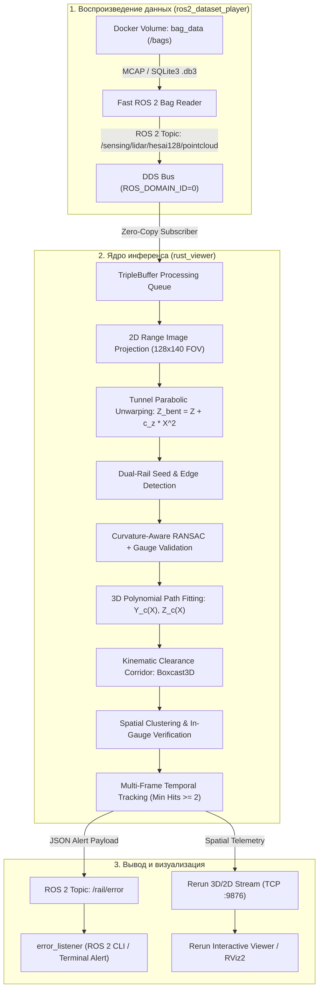

# LDT-2026: Автономная система детекции железнодорожного пути и препятствий в реальном времени
Высокопроизводительный программный комплекс на базе **Rust** и **ROS 2 Humble** для миллисекундного обнаружения рельсовой колеи, аналитического моделирования геометрии пути и выявления критических препятствий по данным 128-лучевого лидара (**Hesai Pandar128**).

---
# БЫСТРЫЙ СТАРТ / КАК ЗАПУСТИТЬ
Все контейнеры полностью собраны и готовы к работе через **Docker Compose** и **Makefile**.

### 1. Подготовка окружения
```bash
git clone https://github.com/FoxStudiosTeam/LDT-2026.git
cd LDT-2026
make setup
```
*(Команда `make setup` создаст файл `.env` из шаблона и подготовит папку `./dataset`)*

### 2. Добавление датасетов
Просто поместите один или несколько ROS 2 bag-файлов (папки с `metadata.yaml` или `.db3` файлы) в папку **`./dataset`**:
```bash
# Скопируйте свои датасеты в папку:
cp -r /path/to/my_bags/* ./dataset/
```
> [!TIP]
> Если датасеты уже лежат в другой директории на хосте, копировать не обязательно — укажите путь в `.env`:
> `DATASET_PATH=/mnt/nvme/eval_datasets`

---

### Сценарии запуска ⚠️

#### Вариант А: Интерактивная веб-панель (UI) — Рекомендуется для визуализации
Запуск графического веб-тюнера, который **автоматически находит абсолютно все датасеты** в `./dataset`:
```bash
make tuner
# или: docker compose up -d rail_tuner_2d
```
🌐 **Откройте браузер по адресу:** **[http://localhost:6080](http://localhost:6080) или адресу удаленного сервера** 
- В выпадающем списке доступен выбор любого датасета из папки `./dataset` без перезапуска.
- Полный плеер: воспроизведение, пауза, покадровая перемотка (scrubber).
- Визуализация 2D Range Image (глубина и интенсивность Pandar128), рельсовых нитей и габарита приближения.
- Двойное окно в Rerun (3D + 2D) при подключении.
---

#### Вариант Б: Запуск полного пайплайна (Детектор + Rerun Web + Плеер + Слушатель)

**1. Запуск детектора пути и препятствий + веб-визуализатора Rerun:**
```bash
# По умолчанию: расширенный пресет Quiet (дальность 50м):
make up

# Или выбор пресета одной командой:
make up-50m    # Пресет Quiet (стабильный режим до 50 метров)
make up-58m    # Пресет QuietPlus (расширенная перспектива до 58 метров)
```
🌐 **Веб-визуализатор Rerun (без установки на ПК):** **[http://localhost:9090](http://localhost:9090)**  
*(3D неискривлённое облако Pandar128, рельсовые нити, полиномы, динамический габарит Boxcast3D и препятствия)*

**2. Запуск слушателя алертов топика `/rail/error` (в отдельном терминале):**
```bash
make listen
# или для сырого JSON: make listen-raw
```

**3. Запуск воспроизведения датасета:**
```bash
# Воспроизвести датасет (автоопределение первого найденного, в цикле):
make play

# Воспроизвести конкретный баг из папки ./dataset:
make play BAG=doubleT_obstacle

# Однократный прогон без цикла (для замера времени/метрик):
make play BAG=doubleT_obstacle LOOP=""

# На удвоенной скорости:
make play BAG=doubleT_obstacle RATE=2.0
```
---

#### Остановка всех сервисов
```bash
make down
```
---


# Содержание ⚠️
asdjhasjkdhas

---
## Описание проекта

Проект разработан для задач автономного вождения рельсового транспорта, систем помощи машинисту (ADAS) и обеспечения безопасности движения в тоннелях, на перегонах, станциях и стрелочных переводах.

Сенсор **Hesai Pandar128** формирует высокоплотный поток данных - 128 лазерных лучей, 10 Гц. Решение автоматически:
- подключается к среде ROS 2 Humble в Docker-контейнере
- принимает и распаковывает ROS 2 bag-файлы лидара
- выполняет проецирование в матрицу дальности и параболический анварпинг геометрии окружения
- распознает рельсовые нити при помощи карты отражательных способностей и аппроксимирует кривизну пути RANSAC полиномами
- строит динамический габарит приближения строений методом Boxcast3D
- выявляет препятствия, классифицирует их как критические или предупреждения с подавлением ложных выбросов через временной трекинг
- транслирует структурированные предупреждения в ROS 2 топик `/rail/error` и визуализирует 3D/2D сцену в реальном времени


---
## Архитектура решения
Решение полностью изолировано в контейнерах и состоит из слабосвязанных модулей, взаимодействующих через стандартные топики ROS 2:



### Основные компоненты:
1. **`ros2_dataset_player`**: сервис прямого чтения bag-файлов из примонтированного ext4-тома Docker. Гарантирует предельную скорость передачи кадров без задержек дискового ввода-вывода.
2. **`rust_viewer`**: аналитическое ядро детекции. Производит распаковку точек, построение карты дальности, оценку геометрии пути, выявление препятствий и отправку алертов.
3. **`error_listener`**: диагностический ROS 2 узел, подписывающийся на `/rail/error` и логирующий состояние пути, дистанцию и критичность препятствий.
4. **Визуализация (Rerun / RViz2)**: интерактивное 3D-отображение облака точек, распознанных рельсов, каркаса габарита и габаритных рамок (Bounding Boxes) найденных объектов.

---


## Эксперименты и метрики производительности ⚠️

Замеры производительности конвейера производились на тестовой машине разработчика со следующей аппаратной конфигурацией:
- **CPU**: AMD Ryzen 5 5600 (6 ядер / 12 потоков)
- **RAM**: 32 GB DDR4
- **OS**: Windows 11 / WSL2 Ubuntu 22.04 LTS

### 1. Замеры времени выполнения этапов конвейера:

| Этап конвейера                                    | Время выполнения (мс) | Доля такта |
| :------------------------------------------------ | :-------------------- | :--------- |
| Чтение и десериализация ROS 2 PointCloud2         | ~6.5 мс               | 13%        |
| Построение Range Image и параболический анварпинг | ~4.2 мс               | 8%         |
| Поиск рельсов и RANSAC-аппроксимация пути         | ~18.5 мс              | 37%        |
| Boxcast3D и кластеризация                         | ~14.0 мс              | 28%        |
| Временной трекинг и классификация статусов        | ~1.8 мс               | 4%         |
| Сериализация JSON и публикация `/rail/error`      | ~0.5 мс               | 1%         |
| Логирование визуализации Rerun (3D Wireframes)    | ~4.5 мс               | 9%         |
| **Полный цикл кадра (Total Latency)**             | **~50.0 мс**          | **100%**   |
|                                                   |                       |            |

### 2. Сравнение с требованиями потока лидара:
- **Время обработки одного кадра**: **$\approx 50$ мс**.
- **Теоретическая пропускная способность**: **до 20 FPS** (кадров/сек).
- **Частота входящего потока лидара в датасетах**: **10 FPS** (1 кадр каждые 100 мс).
- **Коэффициент запаса по производительности**: **$2.0\times$** (решение обрабатывает входящий кадр за половину доступного периода, что полностью исключает буферизацию, накопление очереди и задержки передачи сообщений в ROS 2).
## Сравнение пресетов ⚠️
Эксперименты кока жрут, avg ms: 
- 50 ~200mb ~4%cpu 64.7 мс
- 58 ~200mb ~4%cpu 72.2 мс
за сколько видит в cloud_with_fake_obj датасете:
2х2 центр; 0.3x0.3 центр; 0.3x0.3 рельсы; 0.3x0.3 край; 0.3x0.3 за пределами; 2x2 скраю; 2х2 за пределами; 2x2 сверху; 2х0.2; 0.05x2
50: 49.3m; 45.8m; 40.9m; 27.6m; 29.2m; 38.6m; 41.2m; 46.2m; 47.0m; 33.4m
58: 57.2m; 44.1m; 32.0m; 20.1m; 19.6m; 18.7m;     -; 51.9m; 45.5m; 33.4m

---

## Формат выходных данных топика `/rail/error`

При обнаружении опасных объектов или выходе за габарит формируется JSON-сообщение (`std_msgs/msg/String`):

```json
{
  "status": "CRITICAL_OBSTACLE",
  "frame_id": 184,
  "timestamp_ns": 1788354625800120100,
  "critical_count": 1,
  "warning_count": 0,
  "unlikely_count": 0,
  "total_obstacles": 1,
  "closest_distance_m": 26.40,
  "gauge": 1.524,
  "turn_radius": 950.0,
  "turn_direction": "STRAIGHT",
  "message": "CRITICAL: 1 obstacle(s) detected directly in gauge! Closest at 26.40m",
  "obstacles": [
    {
      "id": 4,
      "status": "Critical",
      "hits": 3,
      "distance_along_track": 26.40,
      "lateral_offset": 0.02,
      "height_above_rail": 0.38,
      "is_critical": true,
      "points_count": 36,
      "bbox_2d": [44.0, 60.0, 50.0, 68.0],
      "bbox_3d_min": [25.95, -0.22, -0.68],
      "bbox_3d_max": [26.85, 0.26, -0.30],
      "size_m": [0.90, 0.48, 0.38]
    }
  ]
}
```

---

## Конфигурация и параметры окружения (`.env`) ⚠️

Конфигурация настраивается в файле [`.env`](.env):

| Параметр | Значение по умолчанию | Описание |
| :--- | :--- | :--- |
| `ROS_DOMAIN_ID` | `42` | Номер домена ROS 2 для изоляции трафика DDS |
| `ROS_ERROR_TOPIC` | `/rail/error` | Топик публикации сообщений об инцидентах |
| `RERUN_URL` | `rerun+http://host.docker.internal:9876/proxy` | URL для передачи телеметрии в визуализатор |
| `PREVIEW_FOV_X_DEG` | `40.0` | Горизонтальный сектор обзора лидара (градусы) |
| `BEGIN_TIMESTAMP` | `0` | Начальная временная метка для пропуска кадров |
| `TOTAL_FRAMES` | `18446744073709551615` | Количество обрабатываемых кадров кадра |
| `TEST_RERUN` | `false` | Режим самодиагностики сетевого подключения Rerun |
| `RENDER_PATH` | `""` | Директория для дампов кадров (опционально) |
